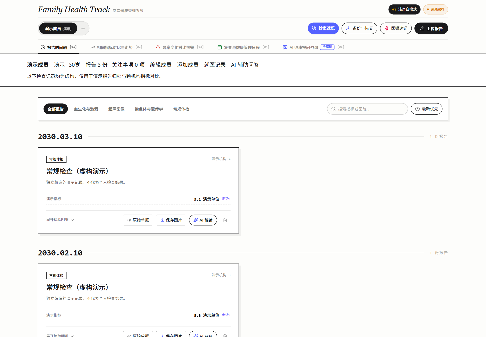

# Family Health Track · 家庭健康档案管理
### 家庭报告归档 · 同类指标匹配 · 历史趋势追踪 (v1.0.0)

[](https://github.com/cheyne2015/family-health-track/releases/tag/v1.0.0)
[](https://opensource.org/licenses/MIT)
[](https://www.typescriptlang.org/)
[](https://react.dev/)
[](https://tailwindcss.com/)
[](https://ai.google.dev/)
[](https://firebase.google.com/)

> **集中管理家庭成员的健康报告，自动匹配不同时间、不同医院化验单上的同类数据。**
> 按时间查看检查结果与指标变化，整理就医资料、咨询问题和复查记录。

---

## 🖼️ 首页预览

<picture>
  <source media="(prefers-color-scheme: dark)" srcset="docs/images/home-dark.png">
  <source media="(prefers-color-scheme: light)" srcset="docs/images/home-light.png">
  
</picture>

实际运行的首页截图，展示独立编造的演示成员与检查记录。默认使用本地模式，不连接预置云项目。

[查看浅色大图](docs/images/home-light.png) · [查看深色大图](docs/images/home-dark.png)

## 🌟 核心功能亮点 (Key Features)

### 1. 📑 报告图片识别与结构化录入

- **图片识别**：上传化验单或检查报告图片，通过多模态模型提取报告内容。
- **字段整理**：整理检查机构、日期、项目名称、结果、单位和参考范围，支持核对与手工补充。
- **报告归档**：按家庭成员保存报告，方便后续查询和比较。

### 2. 📈 不同时间、不同医院的同类指标自动匹配

- **同类数据匹配**：依据统一的指标标识，汇总不同时间、不同医院报告中的同类检查项目。
- **时间趋势展示**：将同一指标的数值按检查日期排序，展示趋势曲线与历史结果。
- **变化对比**：查看相邻检查结果的差值和变化比例，并保留对应医院及报告来源。
- **核对后比较**：识别结果、单位和参考范围需要核对；目前不应假定系统已自动换算不同单位或校准不同检测方法。

### 3. 🔎 异常变化提示与历史回溯

- **变化提示**：汇总已标记的异常结果，辅助发现需要关注的指标变化。
- **回溯记录**：结合日期和原始报告查看历史结果，便于复查时说明变化过程。
- **就医参考**：提示用于资料整理与沟通，不据此自动确定病因或治疗方案。

### 4. 🩺 就医速览与问诊备忘

- **资料摘要**：集中查看成员档案、近期报告、关注事项与待咨询问题。
- **沟通备忘**：整理就医时需要说明和询问的内容，便于与医生沟通。

### 5. 🤖 结合健康记录的 AI 辅助问答

- **记录辅助理解**：结合当前成员的报告和咨询上下文，辅助解释检查项目、整理信息与问题。
- **多轮交流**：围绕历史记录继续提问，并导出咨询记录或整理结果。
- **使用边界**：识别及生成内容需要核对，不替代医生诊断、处方或用药决策。

### 6. 🎙️ 语音记录与就医纪要

- **语音转文字**：在浏览器支持并获得麦克风权限时录入就医记录，也可手工输入。
- **纪要整理**：将输入内容整理为关注事项、检查安排和复查记录，保存前需核对。

### 7. ☁️ 云端同步与本地缓存

- **数据同步**：通过服务端接口及 Firestore 客户端同步健康档案。
- **本地缓存**：在浏览器保存记录供后续读取，实际同步效果取决于部署配置和网络条件。

### 8. 📦 档案备份与恢复

- **完整导出**：将档案、报告和咨询记录导出为备份文件或便于阅读的文档。
- **备份恢复**：从备份导入记录；导出文件可能包含个人健康信息，当前不提供自动脱敏保证。

---

## 🛠️ 技术栈架构 (Tech Stack)

| 层次 | 技术选型 | 说明 |
| :--- | :--- | :--- |
| **前端界面** | React 19 + TypeScript + Vite | 现代化高性能单页架构 |
| **样式与动效** | Tailwind CSS v4 + Motion (Framer Motion) | 优雅排版、自适应深浅色模式、流畅交互过渡 |
| **数据可视化**| Recharts + Canvas | 指标时间序列与参考区间展示 |
| **后端服务** | Node.js + Express + tsx + esbuild | 轻量化全栈服务，同源中继代理 |
| **AI 引擎**   | Google Gemini (`@google/genai`) | 报告图片识别与上下文辅助问答 |
| **数据存储** | Google Cloud Firestore + LocalStorage Edge Cache | 云端持久化存储 + 本地离线高可用双通道 |
| **打包与导出**| JSZip | 完整病例结构化 JSON + 报告图片一键压缩归档 |

---

## 🚀 快速启动与本地运行指南 (Getting Started)

### 1. 环境准备
- **Node.js**: `v18.0.0` 或更高版本（推荐 `v20+`）
- **npm** 或 **pnpm** / **yarn**

### 2. 克隆项目并安装依赖
```bash
git clone https://github.com/cheyne2015/family-health-track.git
cd family-health-track

npm install
```

### 3. 配置环境变量
在项目根目录创建 `.env` 文件（或从 `.env.example` 复制）：
```bash
cp .env.example .env
```
编辑 `.env`：
```env
# Google Gemini API Key（用于报告识别与辅助问答）
# 在 https://aistudio.google.com/ 免费申请
GEMINI_API_KEY="your_gemini_api_key_here"


```

默认没有预置云项目，记录保存在浏览器本地。AI 服务未配置时会提示不可用，不生成预设检查结果。需要云端同步时，先完成自己的身份验证与权限配置；请勿直接开放数据库规则。

### 4. 启动开发环境
```bash
npm run dev
```
打开浏览器访问: [http://localhost:3000](http://localhost:3000)

### 5. 编译与生产部署
```bash
# 执行前端 Vite 打包与服务端编译
npm run build

# 启动生产服务
npm run start
```

---

## 📂 项目结构规范 (Project Structure)

```text
family-health-track/
├── .env.example              # 环境变量配置模版
├── .gitignore                # Git 忽略文件（不等同于敏感信息扫描）
├── package.json              # 项目依赖与构建指令
├── server.ts                 # Express 服务端入口（Gemini API 代理与 Firestore 数据中继）
├── vite.config.ts            # Vite 构建配置
├── firestore.rules           # Firestore 数据库安全规则
├── metadata.json             # AI Studio 与应用元数据声明
├── src/
│   ├── main.tsx              # React 挂载入口
│   ├── App.tsx               # 应用主界面与全生命周期状态管理
│   ├── index.css             # Tailwind CSS 全局样式
│   ├── types.ts              # 核心 TypeScript 数据模型定义
│   ├── components/           # 模块化业务组件
│   │   ├── Header.tsx        # 顶部导航、网络同步状态、主题切换
│   │   ├── MemberProfileBar.tsx # 成员档案与摘要
│   │   ├── TimelineView.tsx  # 病历时间轴主视图与多维过滤器
│   │   ├── IndicatorComparisonView.tsx # 指标时序波动对比与趋势图表
│   │   ├── MilestoneCalendarView.tsx   # 就诊与随访日历
│   │   ├── AiConsultantView.tsx        # AI 辅助问答
│   │   ├── DoctorQuickGlanceModal.tsx  # 就医资料速览卡
│   │   ├── DoctorVisitMemoModal.tsx    # 就医问诊与复查备忘清单
│   │   ├── UploadReportModal.tsx       # 多模态化验单拍照上传与 OCR
│   │   ├── VoiceConsultationModal.tsx  # 门诊实况录音转录与归纳
│   │   ├── ExportDataModal.tsx         # 全量健康数据 ZIP 备份与报告导出
│   │   └── SyncStatusModal.tsx         # 双通道网络加速与云端同步控制台
│   ├── data/
│   │   └── mockHealthData.ts # 独立编造的通用演示数据
│   ├── lib/
│   │   └── firebase.ts       # Firestore 客户端 SDK 与双通道容错引擎
│   └── utils/
│       ├── exportGenerators.ts # 报告生成器（Markdown/文本）
│       └── reportImageSaver.ts # 化验单 Canvas 本地安全渲染
└── RELEASE.md                # v1.0.0 源码版本说明
```

---

## 🔒 数据与隐私说明

- 文档中的功能描述不展示具体个人病程、遗传结果或用药方案。示例数据不能作为诊疗依据。
- 当前上传流程会压缩图片，但不会自动遮盖姓名、条码等身份信息；启用识别时图片可能发送给 AI 服务，云端同步也可能保存报告内容。
- 导出备份包含完整数据，当前未提供自动脱敏导出功能。浏览器缓存也不等同于加密保险库。
- `.gitignore` 忽略部分环境文件和构建产物，不保证所有凭证都被排除。部署前须检查配置、身份验证与数据库权限。
- 当前默认关闭云端连接，Firestore 规则默认拒绝所有读写。旧云项目配置已移除；启用自己的云服务前，仍需实现身份验证与按用户隔离的权限规则。
- 公开版本仅包含独立编造的通用示例。源码与发布版本经过隐私清理；不要将清理前的本地提交合并或推送回仓库。

---

## 📄 开源许可证 (License)

本项目遵循 [MIT License](LICENSE) 开源许可协议。欢迎个人健康管理者、家庭用户与开发者 Star、Fork 或提交 Pull Request 共建！
